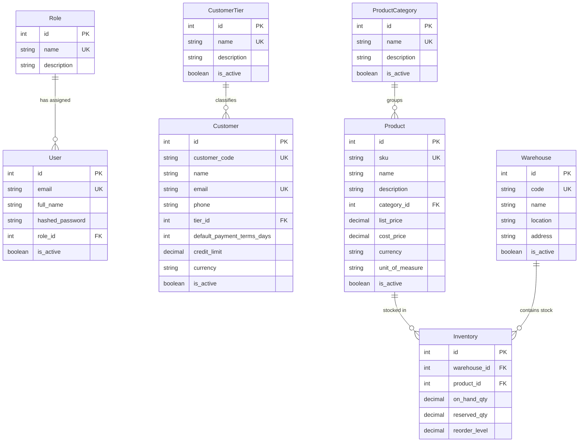

# DealFlow360 Data Model Specification

This document details the database schema and entity relationship structures for DealFlow360.

---

## Entity Relationship Diagram

---

## Current Database Migrations

1. `001_initial_schema_baseline`: Baseline setup.
2. `002_create_roles_and_users`: Identity & Authorization tables (`roles`, `users`).
3. `003_create_core_master_data`: Core Master Data tables (`customer_tiers`, `customers`, `product_categories`, `products`, `warehouses`, `inventory`). Current migration head.
