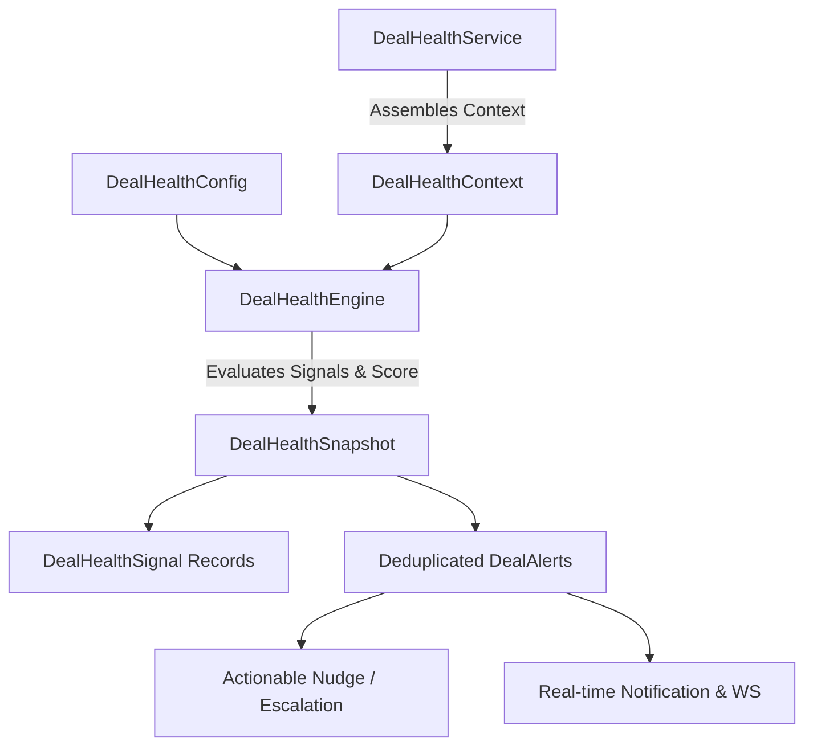

# DealFlow360 — Phase 6 Part 1: Deal Health Engine & Actionable Alerts

## Executive Overview
Phase 6 Part 1 introduces the Deal Health Engine, Anomaly Detection, and Actionable Alerting framework for DealFlow360.
The system continuously and deterministically monitors commercial transactions for risk signals across quotation, approval, negotiation, fulfillment, and payment lifecycles.

## Core Architectural Principles
1. **Explainable Deterministic Scoring**: No opaque black-box AI scores. Every health score (0–100) is mathematically calculated from discrete, explainable business signals.
2. **Decoupled Workflow & Health**: Deal Health (`HEALTHY`, `WATCH`, `AT_RISK`, `CRITICAL`) describes the *condition* of a deal and never overwrites operational Quotation or Sales Order status (`UNDER_NEGOTIATION`, `FULFILLMENT`, etc.).
3. **Alert Deduplication**: Retriggering scans updates active alert occurrence counts and timestamps instead of spamming duplicate notifications.
4. **Actionable Nudges & Escalation**: Users can acknowledge alerts, trigger targeted nudges to sales reps or approvers, and escalate risks to management.

## System Architecture

## Health Levels & Thresholds

| Health Level | Score Range | Default UI Theme | Meaning |
| --- | --- | --- | --- |
| **HEALTHY** | 80.00 – 100.00 | Teal | Deal is progressing normally with minimal risk signals. |
| **WATCH** | 60.00 – 79.99 | Yellow / Amber | Minor inactivity or delay detected; monitor deal. |
| **AT_RISK** | 30.00 – 59.99 | Coral | Significant discount anomaly, approval delay, or negotiation stall. |
| **CRITICAL** | 0.00 – 29.99 | Strong Coral | Severe risks including negative margin or overdue invoices. |

## Signal Types

| Signal Type | Default Weight | Description |
| --- | --- | --- |
| `STALLED_QUOTE` | 20.00 | Open quotation inactive beyond configured days. |
| `DISCOUNT_ANOMALY` | 15.00 | Quote discount exceeds sales rep historical 90-day average by >= threshold pp (min 3 sample size). |
| `APPROVAL_DELAY` | 10.00 | Manager/Finance approval pending beyond configured hours. |
| `NEGOTIATION_STALL` | 15.00 | Customer negotiation inactive beyond configured days. |
| `DELIVERY_SLIPPAGE` | 20.00 | Physical fulfillment pending beyond configured days. |
| `BACKORDER_DELAY` | 10.00 | Open backorders unresolved beyond configured days. |
| `INVOICE_OVERDUE` | 10.00 | Issued invoice past due date with outstanding balance. |
| `HIGH_DISCOUNT_RISK` | 10.00 | Quote risk score exceeds 70.0 / level is HIGH/CORAL_RED. |
| `NEGATIVE_MARGIN` | 25.00 | Quote margin percentage is negative. |

## Security & Access Control
- `ADMIN`, `SALES_MANAGER`, `SALES_REP`, `FINANCE_OPERATIONS`: Full access to internal health intelligence scoped to role.
- `CUSTOMER`: **403 Forbidden** on all deal health, alert, and config endpoints.
